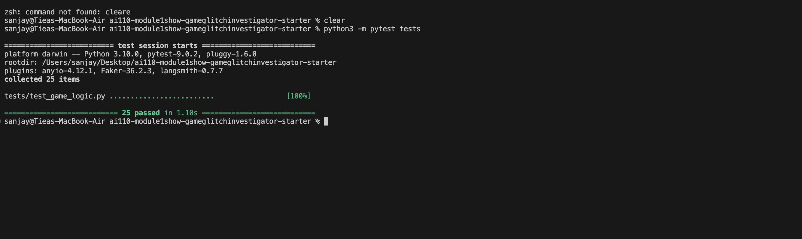

# 🎮 Game Glitch Investigator: The Impossible Guesser

## 🚨 The Situation

You asked an AI to build a simple "Number Guessing Game" using Streamlit.
It wrote the code, ran away, and now the game is unplayable. 

- You can't win.
- The hints lie to you.
- The secret number seems to have commitment issues.

## 🛠️ Setup

1. Install dependencies: `pip install -r requirements.txt`
2. Run the broken app: `python -m streamlit run app.py`

## 🕵️‍♂️ Your Mission

1. **Play the game.** Open the "Developer Debug Info" tab in the app to see the secret number. Try to win.
2. **Find the State Bug.** Why does the secret number change every time you click "Submit"? Ask ChatGPT: *"How do I keep a variable from resetting in Streamlit when I click a button?"*
3. **Fix the Logic.** The hints ("Higher/Lower") are wrong. Fix them.
4. **Refactor & Test.** - Move the logic into `logic_utils.py`.
   - Run `pytest` in your terminal.
   - Keep fixing until all tests pass!

## 📝 Document Your Experience

- [x] **Game's purpose:** A Streamlit-based number guessing game where the player tries to guess a secret number within a limited number of attempts, receiving directional hints after each guess and earning a score based on how quickly they find the answer.

- [x] **Bugs found:**
  1. Hints were swapped — "Too High" said "Go HIGHER!" and "Too Low" said "Go LOWER!" (backwards).
  2. On even-numbered attempts, the secret was converted to a string, causing string comparison instead of numeric — giving inconsistent/wrong hints.
  3. Scoring was unfair — "Too High" guesses gave +5 on even attempts (rewarding wrong guesses), and the win bonus had an off-by-one error (`attempt_number + 1`).
  4. Attempts initialized at 1 instead of 0, costing the player one guess.
  5. Info message was hardcoded to "1 and 100" regardless of difficulty.
  6. Hard difficulty range (1-50) was easier than Normal (1-100).
  7. No validation for out-of-range guesses.

- [x] **Fixes applied:**
  1. Swapped the hint messages so "Too High" says "Go LOWER!" and "Too Low" says "Go HIGHER!".
  2. Removed the even/odd string conversion — secret always stays as an integer.
  3. Made "Too High" always deduct 5 points and removed the off-by-one in win scoring.
  4. Changed initial attempts to 0.
  5. Updated info message to use the actual difficulty range (`{low}` to `{high}`).
  6. Changed Hard range to 1-200.
  7. Added range validation — guesses outside the range show an error message.
  8. Refactored all game logic from `app.py` into `logic_utils.py`.

## 📸 Demo

<!-- TODO: Replace this with a screenshot of your fixed, winning game -->

## 🚀 Stretch Features

- [ ] [If you choose to complete Challenge 4, insert a screenshot of your Enhanced Game UI here]
